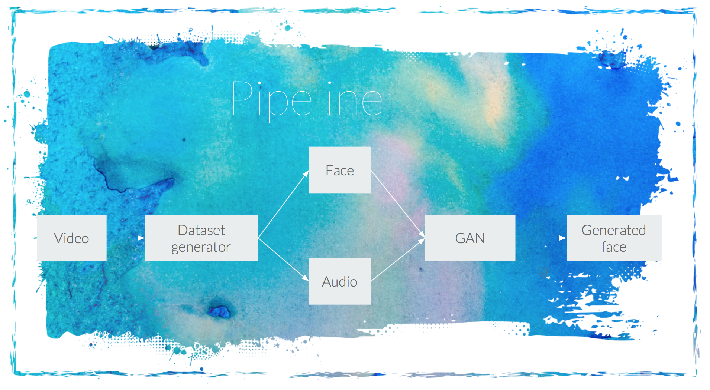
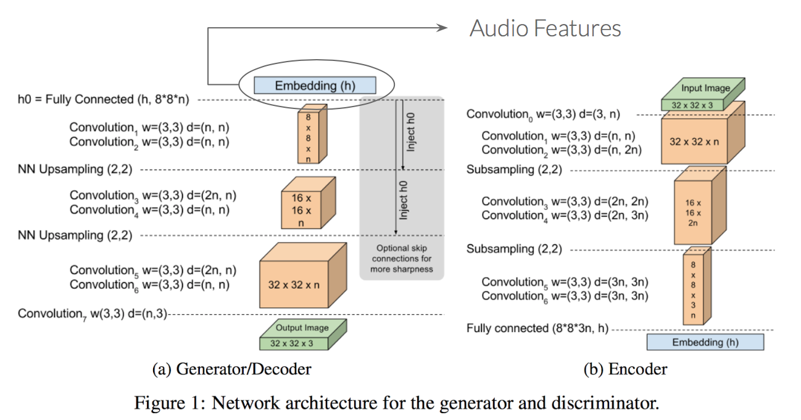
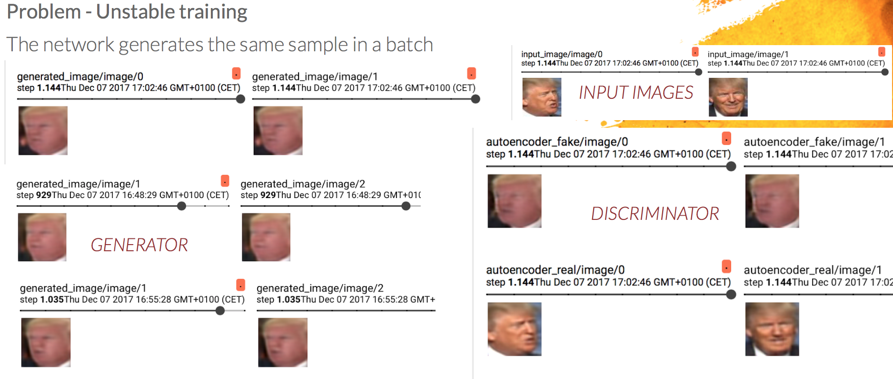
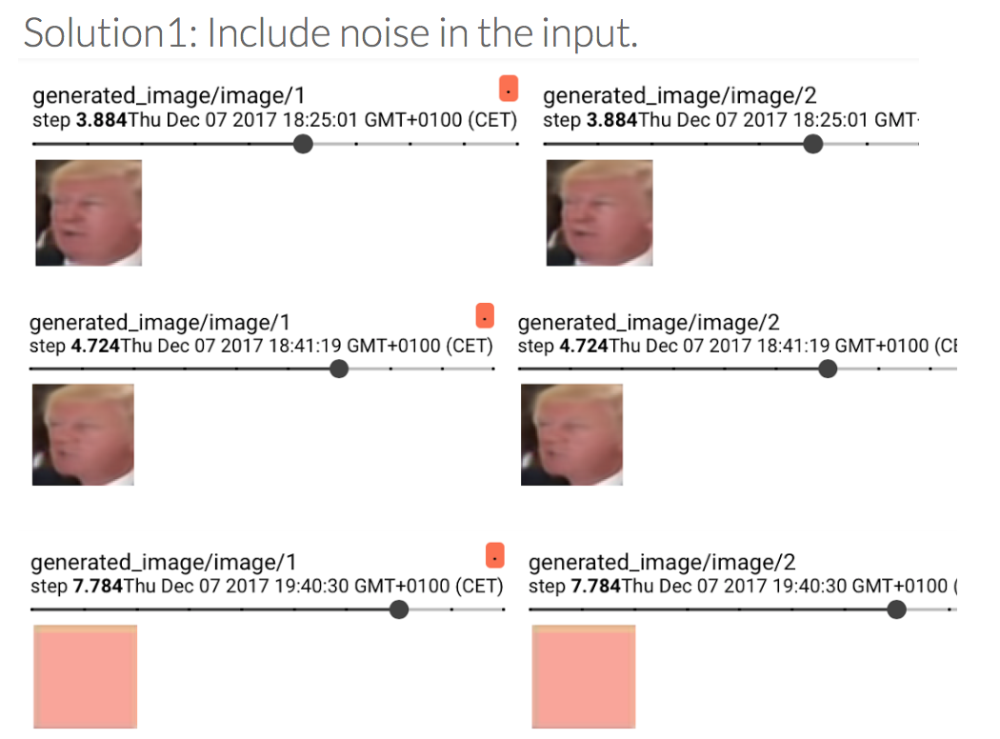
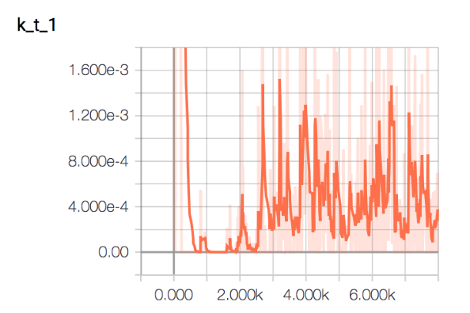
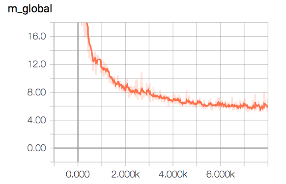
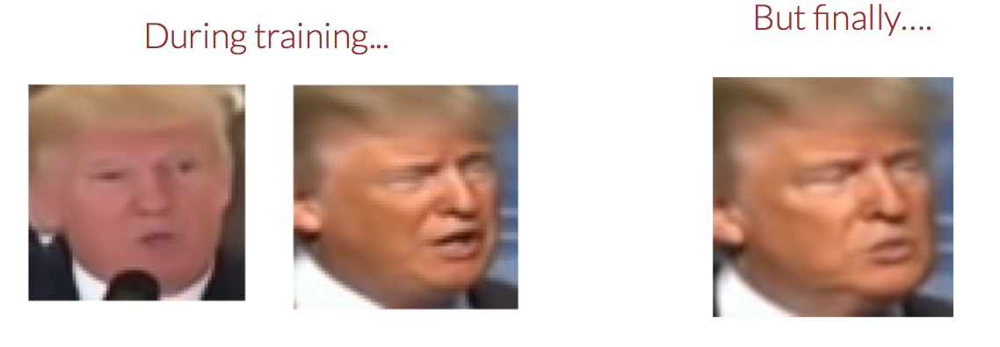

## FACE GENERATION USING GENERATIVE ADVERSARIAL NETWORKS

 [SLIDES](https://docs.google.com/presentation/d/1i9X-fPDfjBX5CcmDRsyYhzLbjXMfhw8-9sB-Cx_A_fc/edit?usp=sharing)

### INTRODUCTION

Our idea is to generate a talking face from an audio segment by using Generative Adversarial Networks (GANs). The architecture used is the proposed by David Berthelot, Thomas Schumm and Luke Metz in their work [Boundary Equilibrium Generative Adversarial Network (BEGAN)](https://arxiv.org/pdf/1703.10717.pdf).
In our case, the input to the Generator network will be the audio features of an audio segment. Those features are obtained by passing the MFCC coefficients of the audio segment through a shallow CNN architecture. By doing that, we provide information to the generator network to be able to generate a face according to the provided audio segment.

### DATASET

In order to train our network, we have also created our own dataset as we did not found any suitable one for our task. The goal was to generate a colection of Donal Trump face images with its asociated audio.
To do so, first we extracted videos from the youtube platform. Then, we cropped them on the parts where Trump was speaking and we extracted the images and audio using a python script that we developed for such task.
We wanted to have well centered faces and with the cleanest audio possible, for that reason we chosed to download videos from Donald Trump public speeches.
Once the videos were selected, we had to process them to obtain both the face and the audio corresponding to the face. 

### FACE EXTRACTION AND PRE-PROCESSING

In order to extract the face we resorted to the well known library for computer vision [OpenCV](https://opencv.org/). Using this library we extracted each frame of the video, then we processed each frame independently to extract the face. On the first iteration of our project we used the Viola Jones face detector. It worked pretty well but had some problems such as a high false positive rate and the fact that the faces where not centered inside the bounding box. To overcome this drawbacks and obtain a better dataset with less variance we changed the face detection algorithm.

### AUDIO FEATURE EXTRACTION

Raw audio data is usually not useful for classification tasks as audio frames have very high dimensionality and the samples are very correlated. So for each frame we need to extract the most important features.
A good way to do so is to compute the Mel-frequency cepstral coefficients for each audio frame. MFCC are easy to compute, widely used in stat of the art applications and with a very good performance.
The MFCC values are made up of individual coefficient each representing a specific frequency band of the audio short-term power on a non-linear Mel scale of frequency.
As the input videos provides us with a 30 faces per second, we decided to get 35ms audio frames to avoid overlapping and 60ms frames to get 50% overlapping. For each audio frame we compute the MFCC coefficients on a sliding window with 50% overlap so we obtain a 2D heat map for every audio frame that shows the evolution of the MFCC. 

### ARCHITECTURE
The architecture proposed in the [Boundary Equilibrium Generative Adversarial Network (BEGAN)](https://arxiv.org/pdf/1703.10717.pdf) is quite different to the general way of building GANs. In this case, we have that the architecture used for the Discriminator network is an autoencoder, while the Generator has only the decoder part. In order to conditioned the Generator network to generate talking faces according to an audio segment, we input to the generator audio features instead of a random noise. Those features have been extracted from a CNN which had as an input the audio segment. This CNN is composed by: Conv (3x3,64) + Conv (3x3,128) + Pool(2)  + Conv (3x3,256) + Conv (3x3,512) + Dense(512) + 
Dense (256).

### PROBLEMS and SOLUTIONS
The training of the system was not as straightforward as we thought. We had to face some problems during the training phase and the generation of the dataset.
During training, the Generator's output was always the same in a batch, so we had a mode collapse problem. 

In this image we can see at the left, the faces generated by the Generator network. Each one of the rows correspond to a batch, so we are showing two samples for each batch. As can be seen, the faces generated in each of the batches are the same within the batch. To the right, we have at the top the input image and below the images generated by the Discriminator network (Remember that the Discriminator in the BEGAN architecture is an autoencoder, so it also generates images). 

In order to overcome the situation, we concatenate to the input audio features a random noise. The reason is that audio features were very similar between each other, so maybe the network was not able to obtain enough information and so it fails in generating different images. The introduction of a random sequence to the input, was thought to provide this variability and so improve the results. But... it also failed.

Here we can see that we still generate the same samples within the batch, and what is more, the Generator network at some point fails completely, and it is not able to ouput faces anymore. 

We decided to finally simplify the network, and input only noise to the generator network. That would be, generate different Trump faces without any audio condition. 
We can see here the evolution of the variable Kt and MGlobal. As can be seen MGlobal decreases, so the generator is able to generate more realistic faces, but, we still generate the same face...

  

The last trick we tried to overcome the situation, was to reduce even more the learning rate and also reduce the batch size to just one image. In that case we were able in training time to generate faces from both of the videos used for training (previously the network was only generating a face corresponding to one of the videos). But finally, when testing we were again generating the same face.
 

### VAE
BLAH BLAH

### FUTURE WORK
BLAH BLAH

### REFERENCES
[1] David Berthelot, Thomas Schumm, Luke Metz [Boundary Equilibrium Generative Adversarial Network (BEGAN)](https://arxiv.org/pdf/1703.10717.pdf) 

